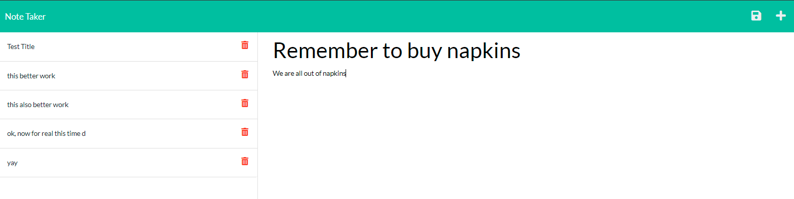

# Note Taker
## Description

This program allows you to write and store notes to a server hosted by [Heroku](https://heroku.com).

## Table of Contents

- [Usage](#usage)
- [License](#license)
- [Contributing](#contributing)
- [Questions](#questions)

## Usage

1. Navigate to [https://limitless-basin-77845.herokuapp.com/](https://limitless-basin-77845.herokuapp.com/) on your web browser to access the app.
2. Click the "Get Started" button to enter the site. All previously entered notes are displayed in the left-hand column.
3. Click a previously entered note title to view its contents.
4. Then, click the "+" icon to enter a new note. You must enter a title and text for the note.
5. Click the Save icon to save your note.
6. Notes can be accessed from any device by visiting the link above.

### NOTE
Note deletion is not currently supported.

## License

## Contributing

Professional readme template generated using [https://github.com/chardmuffin/readme-generator-rth](https://github.com/chardmuffin/readme-generator-rth)

App is hosted on the [Heroku Cloud Application Platform](https://heroku.com)

## Questions

I am on GitHub: [https://github.com/chardmuffin](https://github.com/chardmuffin)

I can also be reached by email at [richardhuffman96@gmail.com](mailto:richardhuffman96@gmail.com)